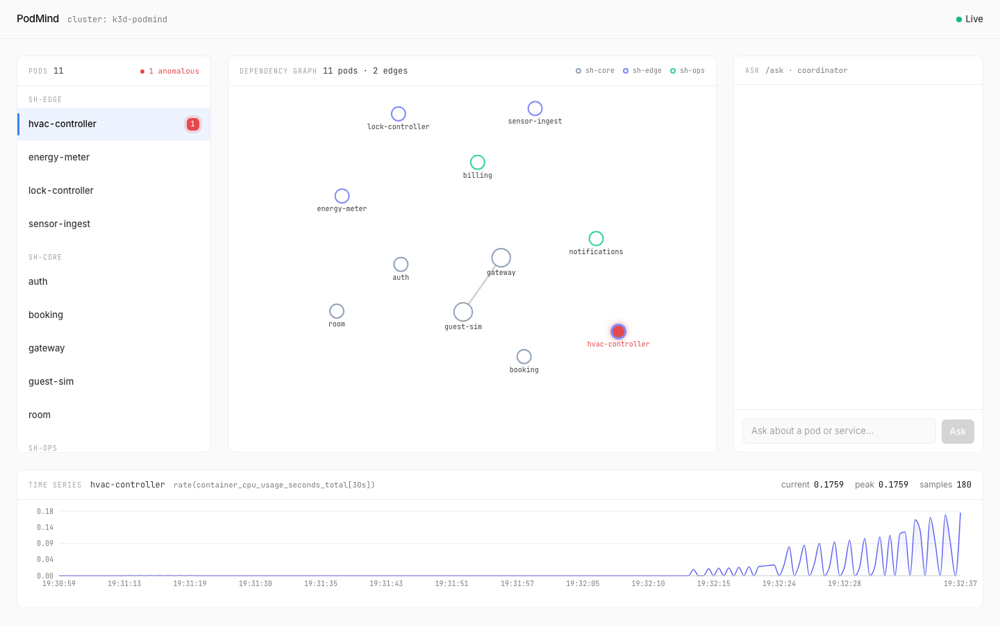
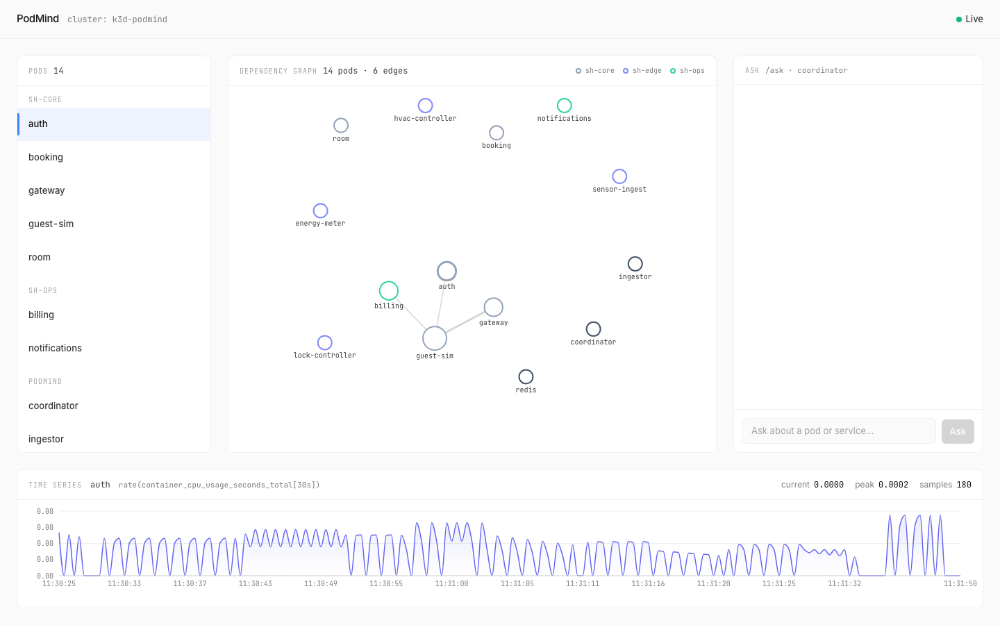
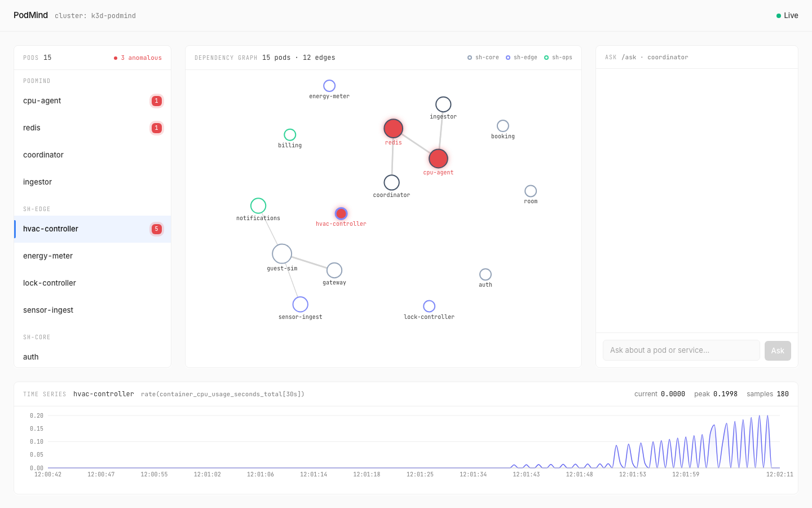
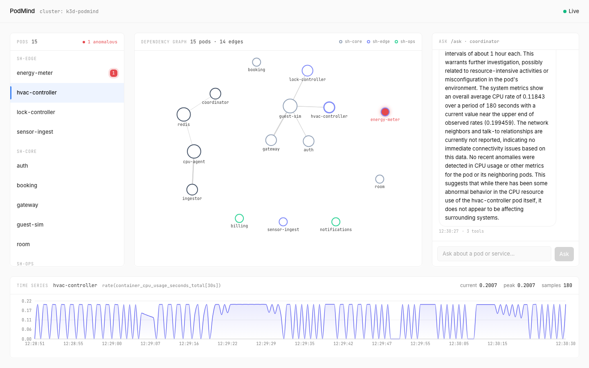

# PodMind

**AI-native observability for single-node Kubernetes that answers *why*, not just *what*.**

PodMind watches a small K3s cluster running a SmartHostel demo app, detects per-pod anomalies with a streaming Isolation Forest, traces real pod-to-pod dependencies from eBPF flows, and answers natural-language questions about cluster state through a local LLM — no cloud, no auth, no Grafana, no service mesh beyond what Cilium gives us.



---

## The story this repo tells

Four moments from the demo, in order. Each is a real screenshot captured against the live cluster (not a mockup).

**1. Calm cluster.** No anomalies, every pod neutral, nothing in the chat log. The dependency graph (centre) is derived from real Hubble flow data — gateway calls auth/booking/room, room reaches the edge controllers, sensor-ingest fans out to hvac and energy-meter.



**2. CPU stress on hvac-controller.** A `yes`-loop runs inside the pod. Within ~15 s the cpu-agent's Isolation Forest crosses the configured threshold and publishes a `Finding` to Redis; the dashboard's findings poll picks it up and the pod turns red — both in the sidebar (with a count badge and severity ring) and on the graph (filled red node with a glow). Nothing else in the cluster lights up — the agent's contamination tuning + threshold keep baseline noise off the canvas.


**3. Drill-down.** Clicking the hvac-controller node pins it as the time-series subject; the footer chart pulls per-pod CPU rate samples from the ingestor's 5-minute rolling buffer. The flat baseline + clean step up to ~0.20 cores is exactly the `rate(container_cpu_usage_seconds_total[30 s])` shape you'd expect from three `yes` processes saturating the pod's CPU limit.



**4. Ask the cluster what's happening.** The chat panel POSTs to the coordinator's `/ask`. The coordinator extracts the pod name from the question and runs three tools in parallel (`get_recent_anomalies`, `get_pod_metrics`, `get_pod_neighbors`) against the ingestor + the Redis-backed findings cache, then asks a local `qwen2.5:1.5b-instruct-q4_K_M` to summarise the JSON in plain English. The answer streams into the chat panel with a typewriter cadence clamped to 2.5–6 s so the UX feels deliberate on camera regardless of model latency.



---

## What's here

| Component | Path | What it does |
|---|---|---|
| `contracts` | `services/contracts/` | Pydantic v2 models shared across services: `MetricRecord`, `HubbleFlow`, `Finding`, `BaselineSummary`, coordinator tool I/O. Frozen, `extra="forbid"`. |
| `ingestor` | `services/ingestor/` | FastAPI app polling Prometheus on a 1 s tick and streaming Hubble flows from the cilium-agent's local unix socket into a 5-minute SQLite/WAL rolling buffer. `/buffer/metrics`, `/buffer/flows`, `/healthz`, `/readyz`. |
| `cpu-agent` | `services/cpu-agent/` | Per-pod rolling windows of CPU-rate samples, Isolation Forest scoring with cached refits, threshold-gated `Finding` publication to Redis `findings.cpu`. |
| `coordinator` | `services/coordinator/` | Ollama tool-calling. Pod-specific questions run a **deterministic** 3-tool fan-out (every call invokes all three tools, in canonical order); cluster-wide questions fall back to the autonomous tool-calling loop. Findings cache subscribes to Redis at startup. Exposes `/ask`, `/findings/recent`, `/healthz`, `/readyz`. |
| `frontend` | `frontend/` | React + Vite + TypeScript + Tailwind. Three-column dashboard: pod list / D3 force-directed graph / chat. Footer time-series. TanStack Query polls 2/3/5 s for findings/flows/metrics. socketLB half-flow pairing on the client so service-VIP traffic still produces meaningful edges. |
| `infra/` | `infra/` | Kustomize stacks for everything in-cluster: SmartHostel demo, guest-sim load generator, ingestor, redis, cpu-agent, coordinator. |
| `scripts/dev-up.sh` | `scripts/` | Idempotent bring-up: K3s (or k3d), Cilium 1.19.1 with Hubble + `socketLB.enabled=true`, kube-prometheus-stack via Helm, image builds, image imports, manifest applies, wait-for-Available across every namespace. |

---

## Demo cluster — SmartHostel

Ten microservices across three namespaces, plus a guest-sim driver that mints synthetic traffic.

```
sh-core            sh-edge              sh-ops
─────────          ─────────            ─────────
gateway            hvac-controller      billing
auth               energy-meter         notifications
booking            lock-controller
room               sensor-ingest
```

The pod images are `nginx:alpine` placeholders — the goal is a realistic dependency graph and traffic pattern, not a working hotel-booking system. Guest-sim hits gateway with synthetic logins/bookings/check-out floods; the rest of the graph emerges from those calls.

---

## Architecture at a glance

```
                 ┌────────────────────────┐
                 │  Prometheus + cAdvisor │
                 │  + node_exporter       │
                 └──────────┬─────────────┘
                            │ 1 s instant query
                            ▼
   ┌────────────┐    ┌──────────────┐    ┌──────────────┐
   │  Hubble    │───▶│  ingestor    │◀───│  /buffer/*    │ (HTTP API)
   │  unix sock │    │  + SQLite WAL│    │              │
   └────────────┘    └──────┬───────┘    └──────────────┘
                            │
                            ▼
                     ┌────────────┐         ┌────────────────┐
                     │ cpu-agent  │────────▶│ Redis pub/sub  │
                     │ (IF + win) │ Finding │ findings.cpu   │
                     └────────────┘         └────────┬───────┘
                                                     │
                                                     ▼
        ┌──────────────────┐               ┌──────────────────┐
        │   Ollama (Mac    │◀──────────────│   coordinator    │
        │   host, Metal)   │   /api/chat   │   /ask /findings │
        │   qwen2.5:1.5b   │   tools       │                  │
        └──────────────────┘               └────────┬─────────┘
                                                    │ HTTP
                                                    ▼
                                          ┌──────────────────┐
                                          │  frontend (Vite) │
                                          │  3-col dashboard │
                                          └──────────────────┘
```

The local-LLM choice is deliberate: PodMind targets edge / industrial deployments where cloud LLMs aren't acceptable, and the same constraint forces us to make the tool layer carry the reasoning rather than leaning on model capability.

More detail in [`docs/architecture.md`](docs/architecture.md).

---

## Tier status

Per the project brief, features are tiered "must / target / wow." Status as of the latest commit:

| Tier | Component | Status |
|---|---|---|
| 1 | eBPF dependency graph (Hubble → buffer → dashboard) | **shipped** |
| 1 | CPU agent + Redis Findings | **shipped** (known IF detection-window limitation — see brief) |
| 1 | Coordinator with local-Ollama tool calling | **shipped** (deterministic 3-tool path for pod-specific Qs + autonomous fallback) |
| 1 | Three-column dashboard | **shipped** |
| 2 | Memory agent | not started |
| 2 | Storage / PVC agent | not started |
| 2 | Causal overlay (PCMCI on the rolling buffer) | not started |
| 3 | Network / IO agent | not started |
| 3 | LSTM forecasting (90 s OOMKill prediction) | not started |

---

## Running it locally

Requirements: **Docker** (OrbStack on macOS works), **kubectl**, **helm**, **k3d** or native K3s, **uv**, **node 20+**, **Ollama** running on the host.

```bash
# 1. Pull the small model the coordinator uses
ollama pull qwen2.5:1.5b-instruct-q4_K_M

# 2. Bring up the whole stack (idempotent; re-runnable)
make up

# 3. Run the dashboard
cd frontend
./scripts/dev-ports.sh     # in one terminal — kubectl port-forwards to ingestor + coordinator
npm install && npm run dev # in another terminal — Vite on :5173
```

Open http://localhost:5173. To watch an anomaly fire, exec into any pod with `kubectl exec` and run a short `nohup yes > /dev/null 2>&1 &` to spike CPU; the dashboard should turn that pod red within ~15 s and a Finding lands on Redis.

To talk to the cluster:

```bash
# Ingestor — metrics + flows
kubectl -n podmind port-forward svc/ingestor 8000:8000
curl 'http://localhost:8000/buffer/metrics?since=-30s' | jq

# Coordinator — natural-language /ask
kubectl -n podmind port-forward svc/coordinator 8001:8000
curl -X POST http://localhost:8001/ask \
  -H 'Content-Type: application/json' \
  -d '{"question": "what is happening with hvac-controller?"}' | jq
```

---

## Tests

```bash
make test          # all packages
make test-contracts
make test-ingestor
make test-cpu-agent
make test-coordinator
```

At the time of the latest commit: **13 contracts + 17 ingestor + 16 cpu-agent + 33 coordinator = 79 backend tests passing**, plus `ruff` clean across `services/`. Frontend has a clean `tsc` build; tests there are not wired up.

---

## Known limitations

Captured in [`podmind-brief.md`](podmind-brief.md) under *Follow-ups / known operational hazards*. The two worth knowing about before judging the demo:

- **CPU agent detection window.** Isolation Forest scores collapse 30–45 s into a sustained anomaly because the next refit folds the stressed samples into the training set. We evaluated a lag-aware fitting strategy that fixed the collapse but multiplied baseline false-positive rate ~7×; for the demo we accepted the shorter detection window in exchange for a quiet baseline.
- **socketLB + Hubble half-flows.** Service-VIP traffic under Cilium's socketLB shows up in Hubble as two halves — one with sender identity, one with receiver identity, never both on the same row. The ingestor records `trace_observation_point` and the dashboard pairs halves on `(src_port, dst_port)` so the graph still has meaningful edges; the alternative (disable socketLB) would re-break Prometheus's pod-to-host-IP scrapes.

---

## License & credits

Built for the "Beyond Monitoring" competition. Single-author project; see `podmind-brief.md` for the design rationale and `docs/architecture.md` for the technical write-up.
