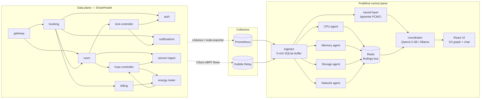

# PodMind — Architecture

## Why

Existing observability tools tell you *what* changed: pod X's CPU
spiked, deployment Y restarted, service Z's p99 doubled. They don't
tell you *why* — and at 3am, that gap is the whole problem. Operators
end up scrolling charts, eyeballing dashboards, and guessing at the
cascade.

PodMind closes that gap on a single Kubernetes node. eBPF discovers the
real dependency graph (not what someone wrote down once). Causal
inference picks out which neighbours actually cause changes elsewhere
(not just correlate). A multi-agent system summarises the answer in
plain English, with a local LLM so nothing leaves the box.

## System diagram

## Data flow

A SmartHostel pod calls another SmartHostel pod over plain HTTP.
Cilium's eBPF datapath sees every packet and emits a flow event into
Hubble Relay. The kubelet's cAdvisor and the node-exporter DaemonSet
expose container and host metrics on `/metrics`, scraped by Prometheus
on the usual 15s interval.

The **ingestor** is the single point where these two streams meet. It
polls Prometheus on a 1s instant-query cadence — one sample per series
per tick, no overlapping windows. It tails Hubble Relay's
`Observer.GetFlows` gRPC stream. Both go to a SQLite buffer in WAL
mode that holds the last five minutes; a sweeper trims anything older
every 30 seconds. Agents and the coordinator query this buffer, not
Prometheus or Hubble directly. The buffer is the contract.

The four **agents** each watch one signal class — CPU/throttling,
memory/RSS slope, PVC I/O latency and fsync stalls, eBPF flow churn.
They run as separate Python processes and never talk to each other;
when one decides something is anomalous it publishes a `Finding` to a
Redis pub/sub channel. Decoupling them this way means the storage
agent can pause for a slow PCMCI fit without making the CPU agent miss
a spike.

The **causal layer** runs PCMCI (from `tigramite`) on the buffer's
metric matrix every 30 seconds. It produces directed edges with lag
and confidence, overlaid on the dependency graph that Hubble already
gave us. This is where "X *causes* Y" comes from rather than "X
*correlates with* Y."

The **coordinator** is a local Qwen2.5-3B served by Ollama. It runs a
tool-calling loop with four tools — `get_pod_metrics`,
`get_causal_parents`, `get_recent_anomalies`,
`get_dependency_neighbors` — and exposes `/ask` (free-form question)
and `/explain` (right-click on a graph node).

The **frontend** is a React + TypeScript SPA. The centerpiece is a D3
force-directed graph; node colour reflects agent-reported health, edge
colour distinguishes causal edges (PCMCI-confirmed) from observed
edges (Hubble-only). Recharts handles per-pod time series; the chat
panel docks right.

## Tech choices and why

- **K3s** — single-node Kubernetes that fits the edge framing, comes
  with cAdvisor built in, no separate control plane to babysit.
- **Cilium + Hubble** — only practical way to get ground-truth
  pod-to-pod dependencies on a Linux box. A service mesh would impose
  the graph; eBPF observes what's actually happening.
- **Prometheus** — boring choice, but the kubelet already exposes the
  right metrics in Prom format. No reason to invent a TSDB.
- **SQLite WAL buffer** — five-minute window, single file, zero ops.
  Agents don't need a real database; they need cheap reads against a
  small recent window.
- **Pydantic v2** — every wire shape between services lives in one
  shared package (`podmind-contracts`). If an agent and the ingestor
  disagree about a field, the build catches it.
- **Ollama + Qwen2.5-3B** — local inference, no cloud dependency. 3B
  is small enough to share the node with everything else and big
  enough to do multi-step tool use competently.
- **tigramite PCMCI** — actual causal inference rather than
  correlation. Handles lagged dependencies, which is what real
  cascades look like.
- **FastAPI everywhere** — same shape across services: lifespan,
  async endpoints, Pydantic models, pytest. One stack, learned once.

## Tier boundaries

PodMind is built in three tiers so the demo always has something to
show even if the wow features slip.

- **Tier 1 (must ship)** — eBPF dependency graph, CPU agent,
  coordinator, dashboard. The core experience: ask a question, get an
  answer grounded in observed reality.
- **Tier 2 (target)** — add the storage and memory agents; overlay
  PCMCI causal edges on the dependency graph.
- **Tier 3 (wow)** — network agent and an LSTM that predicts OOMKills
  90 seconds out.

Tier 1 quality is never traded for Tier 2 features. Out of scope even
if asked: multi-cluster, dashboard auth, custom TSDB, CI/CD, Helm
charts for our own services, service mesh beyond Cilium, K8s
operators.
